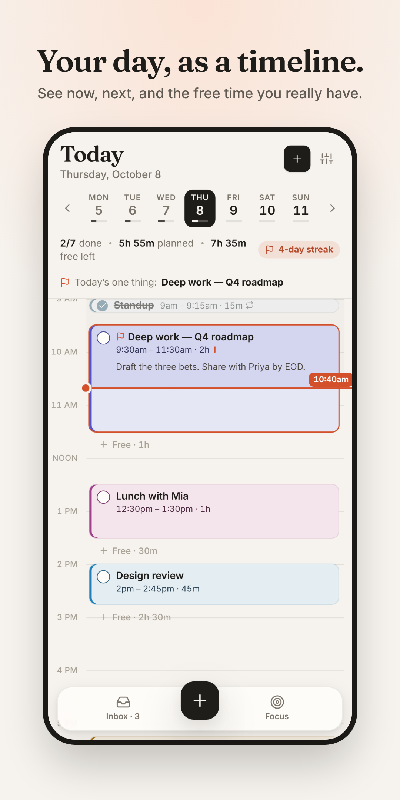
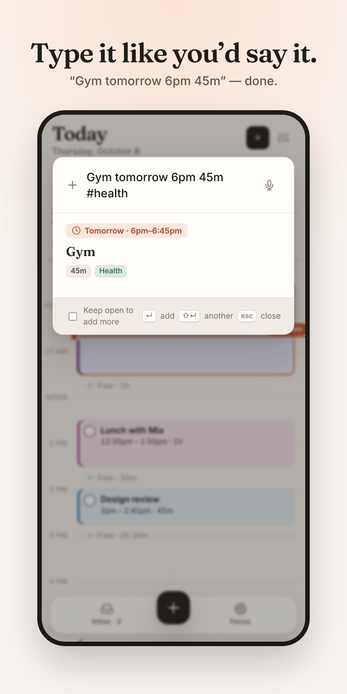
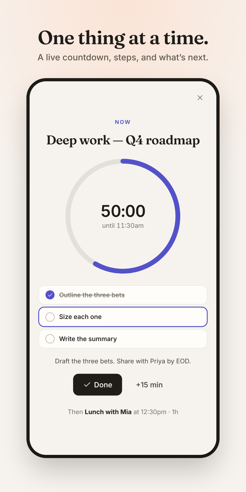
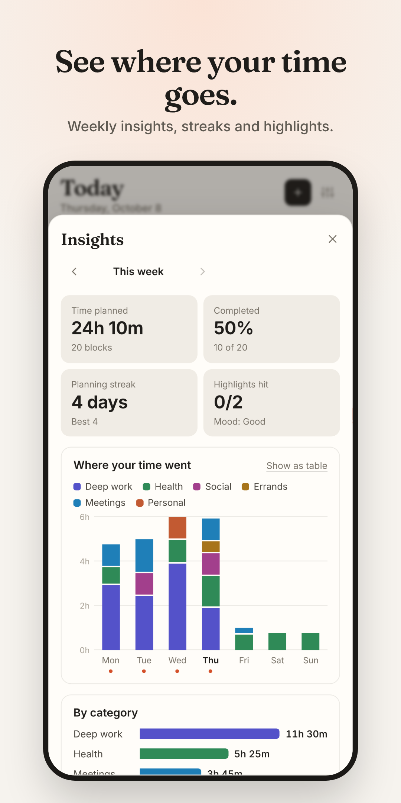

# Day Planner

A timeline-first day planner for Android and the web. See your day as one calm timeline, drag things into place, protect your free time, and let gentle nudges keep you on track.

<p align="center">
  
  
  
  
</p>

**Web:** https://phacharapol18.github.io/Day-planer/ · **Android:** built by CI (see [docs/android.md](docs/android.md)) · **Launch kit:** [docs/play-store.md](docs/play-store.md)

## Features

| | Free | Pro |
|---|:-:|:-:|
| Timeline with live now-line, drag / resize / draw blocks, free-time gaps | ✓ | ✓ |
| Inbox, next-free-slot scheduling, missed tasks resurfaced | ✓ | ✓ |
| Natural-language quick add, brain dump, voice capture, share-to-inbox | ✓ | ✓ |
| Repeating routines with steps checklists | 3 | Unlimited |
| Reminders before blocks, Focus mode, undo/redo, light/dark themes | ✓ | ✓ |
| Morning plan & evening shutdown rituals, daily highlight, streaks | ✓ | ✓ |
| **Auto-plan**: fill free time by priority | | ✓ |
| **Re-plan slipped blocks** into the rest of the day | | ✓ |
| **Phone calendars** (Google, Outlook, Samsung) on the timeline | | ✓ |
| **Home-screen widgets** (Now & next, Today) | | ✓ |
| **Live Now card** in notifications with Done / +15 min | | ✓ |
| **Weekly insights** | headline stats | full breakdown |

Plans live on the device: no account, no ads, no tracking. Android Auto Backup carries them to a new phone, and JSON backup and `.ics` export are built in.

### Quick-add syntax

`9am` · `2-3:30pm` · `45m` · `1.5h` · `tomorrow` · `fri` · `oct 20` · `by friday` · `!!` · `#health` · `daily` · `every weekday`. Without a time, the task goes to the inbox. Put several tasks in one input with new lines or "then / also": `call mom tomorrow then gym 6pm also buy milk`.

## Architecture

```
src/lib/        pure, unit-tested logic: model, parser, layout & free time, store + undo, storage,
                journal/streaks, insights, replan, brain dump, snapshot, .ics, entitlement
src/            React 19 + TypeScript UI (Vite, PWA)
src/native/     Capacitor bridge: snapshot sync, pending actions, deep links, back button, voice
src/pro/        Google Play Billing (Pro), paywall, gating
android/        Capacitor 8 shell + native Java: alarms, notifications, widgets, calendar, tile, share
```

The web app is the source of truth. It pushes a snapshot of yesterday through the day after tomorrow to native storage, so alarms, the Now card and widgets work with the app closed. Anything done natively (Done, +15 min, shared text) is queued and replayed into the app. See [docs/android.md](docs/android.md).

## Develop & test

```bash
npm install
npm run dev                      # http://localhost:5173
npm test                         # 60 unit tests
npm run build && npm run test:e2e  # 33 Playwright tests (desktop + Pixel 7)
```

Every push runs:
- **Test & deploy**: typecheck, unit tests, e2e, then publishes the web app to GitHub Pages from `main`.
- **Android**: lint, debug APK, a signed AAB once secrets are set, then the app on an **Android 14 emulator**:
  - a 10-step device smoke test: Now card, notification Done button, share, deep links, Back, widgets, alarms, phone calendar, crash, ANR and Play-services-link checks;
  - on-device widget render tests.

### Upgrading from v1

Notes saved by the original hour-row scheduler are imported into today's timeline automatically.
