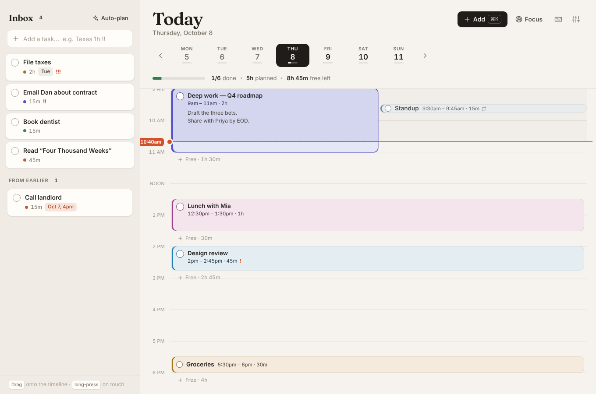
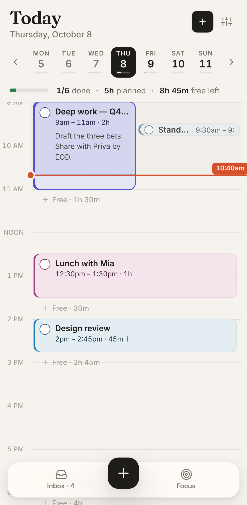

# Day Planner

A timeline-first day planner. Capture tasks in an inbox, drag them onto your day, and see your free time at a glance. It works offline and installs as an app on phone or desktop.



<p align="center"></p>

**Live:** https://phacharapol18.github.io/Day-planer/

## What it does

| | |
|---|---|
| **Timeline** | Your day as a vertical timeline with a live "now" line. Drag to move, drag the bottom edge to resize, or drag across empty time to draw a block. Overlapping blocks sit side by side. |
| **Free time, visible** | Open stretches inside your working hours are labelled (`Free · 1h 30m`). Click one to fill it. |
| **Inbox** | Unscheduled tasks, sorted by priority and due date. Drag a task onto the timeline, or press the calendar button to drop it into the next free slot. Drag a block back to the inbox to unschedule it. |
| **Auto-plan** | Fills the day's free time with inbox tasks, highest priority first. Nothing gets overlapped, and it tells you what didn't fit. Fully undoable. |
| **Plain-language add** | `⌘K` → `Lunch with Mia fri 12:30 1h #social !!` A live preview shows exactly where the task will land before you press Enter. |
| **Missed tasks** | Unfinished blocks from earlier days resurface under *From earlier*, ready to reschedule. |
| **Repeats** | Daily, weekdays, or weekly. Done state is tracked per day, and you can remove a single occurrence. |
| **Focus mode** | `F`: the current block full-screen, with a countdown ring, Done / +15 min, and what's next. |
| **Undo everything** | `⌘Z` / `⇧⌘Z`, plus an Undo button on every destructive toast. |
| **Yours, offline** | Data stays in your browser. It syncs across open tabs, can be backed up and restored as JSON, and exports to any calendar app as `.ics`. Installable PWA with optional reminders when a block starts. |
| **Accessible** | Every block can be operated from the keyboard (`↑↓` move, `⇧↑↓` resize, `Space` done, `↵` edit, `⌫` delete). Dialogs trap focus, colors adapt to light and dark mode, and reduced motion is respected. |

### Quick-add syntax

| Type | Examples |
|---|---|
| Time | `9am` `14:30` `at 4` (→ 4pm) `noon` |
| Range | `9-11:30` `2-3pm` `11-1pm` |
| Duration | `45m` `1h` `1.5h` `1h30` `for 2 hours` |
| Date | `today` `tomorrow` `fri` `next mon` `oct 20` `in 3 days` `by friday` |
| Priority | `!` `!!` `!!!` `!high` `p1` |
| Category | `#work` `#meeting` `#health` `#personal` `#social` `#errand` (plus aliases such as `#gym` and `#call`) |
| Repeat | `daily` `every weekday` `weekly` `every monday` |

With a time, the task goes on the timeline. Without one, it goes to the inbox, and any date becomes its due date.

## Develop

```bash
npm install
npm run dev          # http://localhost:5173
npm test             # unit tests (parser, layout, store, storage)
npm run build && npm run test:e2e   # Playwright, desktop + Pixel 7
```

The stack is React 19, TypeScript, and Vite, with `vite-plugin-pwa` for offline support. There is no UI framework and no date library. Times are stored as minutes from midnight on local calendar dates, so a 9:00 block stays at 9:00.

```
src/lib/      pure logic: model, natural-language parser, layout & free-time math, store + undo, storage, .ics
src/drag.tsx  pointer-based drag engine (mouse, pen, touch long-press, edge auto-scroll)
src/components/  Timeline, Inbox, Header, Editor, QuickAdd, Focus, Settings, Help, Toasts
```

### Deploying

`.github/workflows/deploy.yml` runs typecheck, unit tests, the build, and the end-to-end tests on every push and pull request. On `main` it then publishes `dist/` to GitHub Pages. To enable it, go to **Settings → Pages → Build and deployment** and set **Source** to **GitHub Actions**.

### Upgrading from v1

Notes saved by the original hour-row scheduler are imported automatically into today's timeline the first time v2 opens.
